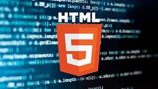

# Desafio Página HTML

Página HTML 

tags utilizadas : <'h1> até <'h6'>, <'mark'>, <'p'>, <'small'>, <'i'>, <'u'>, <'strong'>, <'ol>, <'ul'>, <'li>, <'a'>, <'hr'>, <'sub'>, <'sup'>, <'font'>, <'del'> e <'abbr'>.

## Conteúdo

. História dos Computadores

. O que são clients

. O que são servers

. Estrutura HTML

. links Relacionados
